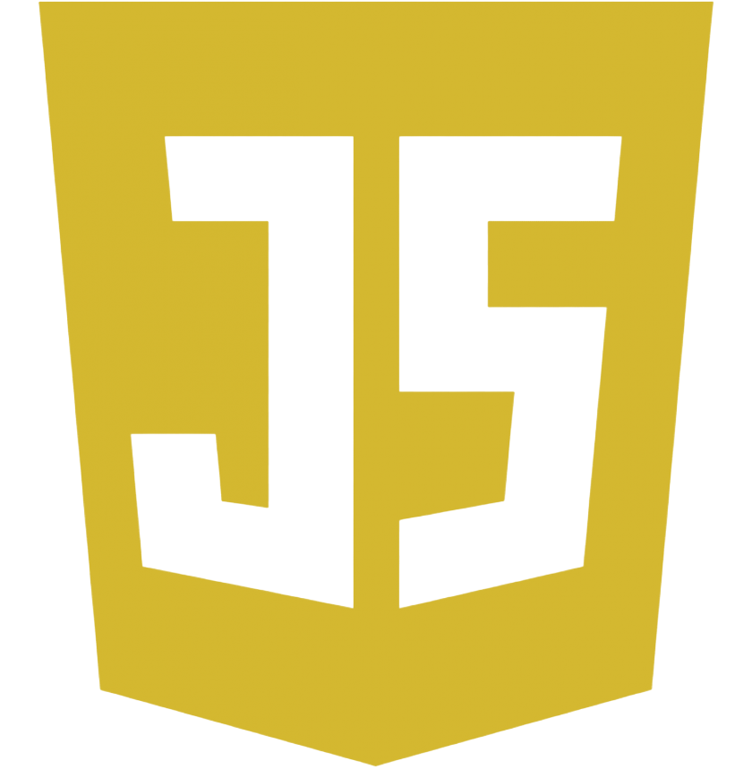
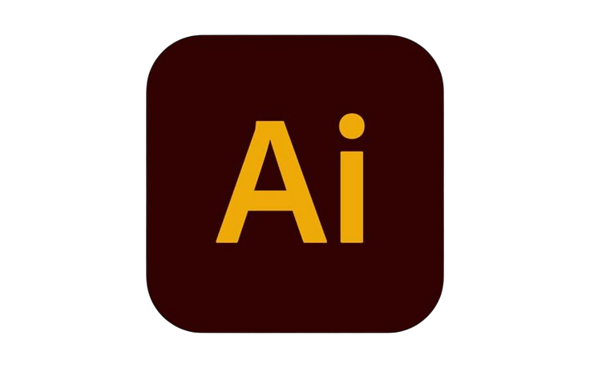
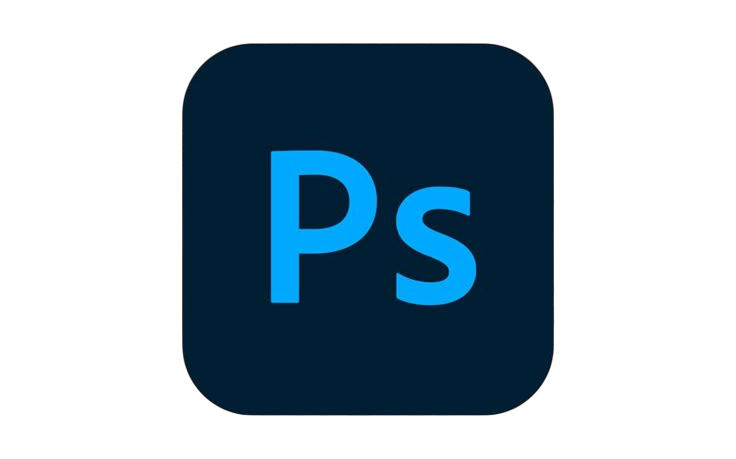

<!-- HuynhNghiaKHMT -->

<!-- https://simpleicons.org/ -->
<!-- https://github.com/Ileriayo/markdown-... -->
<h2 align="center" style="color:#b400ff">💻 Language & Technology ⌨️</h2>
 

&nbsp;

    Python

&nbsp;

&nbsp;

    Css3

&nbsp;

    Javascript

&nbsp;

&nbsp;

&nbsp;

&nbsp;

&nbsp;

&nbsp;

&nbsp;

&nbsp;

<h2 align="center" style="color:#b400ff">🤖 Machine & Deep Learning 🧠</h2>
 

&nbsp;

&nbsp;

&nbsp;

&nbsp;

&nbsp;

&nbsp;

&nbsp;

&nbsp;
 

<h2 align="center" style="color:#b400ff">🎨 Design & Animation Tools ✨</h2>
 

&nbsp;

&nbsp;

&nbsp;

    Illustrator

&nbsp;

    Photoshop

&nbsp;
 

<h2 align="center" style="color:#b400ff">🐙 GitHub Stats ⭐</h2>
<!-- https://github.com/anuraghazra/github-readme-stats -->
 

  
  

 

<h2 align="center" style="color:#b400ff" >🌐 Where to find me 🔗</h2>
 
<!-- https://icons8.com -->

  
  
  

 

<!-- https://github.com/PiyushSuthar/github-readme-quotes -->
<h2 align="center" style="color:#b400ff">💡My Favorites Quote💡</h2>
 

    
"Động lực là thứ giúp bạn bắt đầu, kỷ luật là thứ giữ bạn tiếp tục."

    
- Huynh Trung Nghĩa

<h2 align="center" style="color:#b400ff">✨ Repositories ✨
</h2>
 

